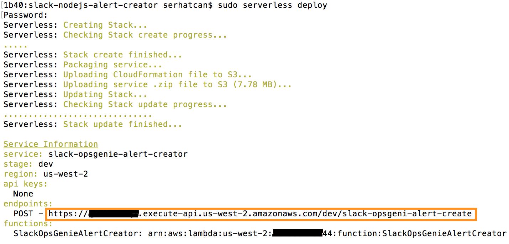
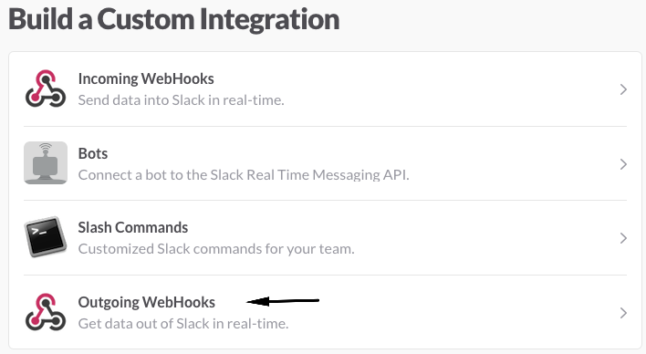

# Slack to OpsGenie Alert Creator

Some of our customers want a way to create alerts from messages sent to a Slack channel.
This is a sample Lambda function to help you achieve this.

It is an `Outgoing WebHook` application for Slack. Slack will post the messages sent to a channel to our API Gateway endpoint and we will create an alert in OpsGenie by using our AWS Lambda function.

## Prerequisites

* Install Node.js and npm

## How to use

- Clone or download the repository
- In repository's folder run `npm install` command

- Install serverless for easy deployment, it will deploy lambda function and create an API Gateway endpoint automatically
  - Run `npm install -g serverless` to install `serverless` globally
  - Update `serverless.yml` file by entering `slackToken` (received from Slack integration page) and `opsgenieApiKey` (received from OpsGenie Api Integration) environment variables
  - [Follow these instructions on setting up AWS credentials for Serverless](https://serverless.com/framework/docs/providers/aws/guide/credentials/) if you haven't done already
  - Run `serverless deploy` and all you want will be ready at a glance!
  - Copy the link from the command line (one in the orange square in the image below) or you can always find it in your AWS account's API Gateway service
  - Paste it to your Slack integration
  - You can always take it back by running `serverless remove` command

### In Slack

- Go https://slack.com/apps/build/custom-integration and add a new Outgoing Webhooks integration

- Configure your Outgoing Webhook
  - Select a channel (optional)
  - Select a keyword (optional)
  - Paste the url received after deployment (Api Gateway URL)
  - Copy `token` and paste it to `serverless.yml`'s slackToken field

